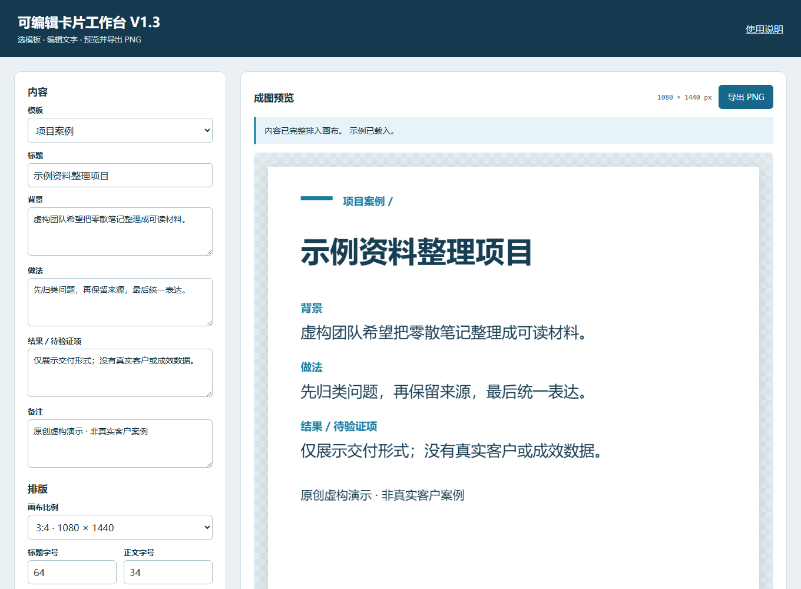

# 可编辑卡片工作台 V1.3 / Card Workbench

上图为实际桌面浏览器截图，使用内置虚构案例，不是真实客户成果。下载完整仓库并解压，打开同目录的 `index.html` 即可试用；不需要安装依赖或注册账号。不要只下载一个HTML文件，也不要直接在ZIP预览中运行。此仓库提供离线工具源码，不是在线托管应用。

## V1.3 纯文字交接

“导出纯文字稿 TXT”按当前模板字段顺序导出标签与原文，包括空字段和手动换行。文件名固定为 `card-text.txt`，UTF8 带 BOM，最大1MiB。导出前请人工核查私人信息及未核验承诺。

这份文字不包含排版，不自动增加步骤编号，不是编辑稿，也不能导入工具。画布溢出仍可导出全部文字，不会截断，不会把未保存状态改为已保存。后续继续编辑应另存 JSON。原有画布渲染和图片导出未修改。三步：编辑字段 → 导出文字稿 → 用文本编辑器检查后交接。新增实际检查见 TEXT_EXPORT_RESULTS.md。

## V1.2 可读性参考

颜色设置下新增正文/背景、强调文字/背景的对比度比值。低于4.5时提示调整，但不自动改色或阻止导出。仅检查所选不透明纯色；并非完整无障碍合规认证或印刷效果保证。不能仅凭画布字号判断最终显示是否属于大字。

使用 sRGB 相对亮度计算，显示三位小数但阈值判定不舍入。依据：[W3C 对比度说明](https://www.w3.org/WAI/WCAG22/Understanding/contrast-minimum.html)。JSON 仍为 version 1，渲染布局和像素生成未改变。已有稿件不需要转换。

新增 `test-contrast.cjs`，使用已有 Playwright（PLAYWRIGHT_MODULE）。可选 CARD_BASELINE 指向原版目录，比较默认画布完整 PNG 字节。不安装依赖也能正常使用工具。

六种离线文字卡片：招聘、通知、步骤、知识卡片、对比说明和项目案例。独立浏览器工具，无账号、云同步、运行时依赖、图片 API 或外部字体。

## 三步使用

1. 保持文件同目录，用桌面浏览器打开 `index.html`。选择模板，替换虚构示例。招聘的岗位、地点、薪资、要求、联系方式分别填写，不会自动加入商超品牌或 Logo。
2. 调整字号、行距与颜色，选择 3:4、9:16 或自动高度。溢出会停止导出，不会静默截断输入。检查画布，确认没有敏感信息或未经确认的承诺。
3. 导出 PNG；要继续编辑，另存可编辑 JSON。下次通过“打开可编辑稿”载入。只导出 PNG 不等于保存了可编辑稿。

## V1.1 修复

旧版在先后打开两个稿件、较早的文件读取较慢时，可能让旧读取结果覆盖新稿。V1.1 保留最后一次读取，并拒绝覆盖读取期间发生的文字、模板、设置或重置变化。读取时暂时禁用打开按钮；结束后恢复。错误文件保留现有稿件。载入只接受不超过 128 KiB 的 `.json` 文件；V1 有效稿件保持兼容。

页面仍不自动保存。切换、清空、离开有相应提示，但不能防止系统强制退出或浏览器崩溃。请主动保存并确认下载成功。导出和 JSON 都可能含有你输入的私人信息，分享前需人工检查。

## 排版边界

固定画布 1080×1440 或 1080×1920；自动高度为 1440–6000，宽 1080。标题 32–100px、正文 22–60px、行距 1.15–2.2；标题最多 600 个 JavaScript 字符，其他字段最多 10000。超限保留输入并暂停导出。预览与 PNG 使用同一个画布。只使用系统字体，不分发字体文件；换系统可能影响换行。

全部内置示例为虚构，案例未宣称真实客户结果，联系方式不含真实手机号。此版本复用已存在的本地卡片工具并定向修复，不是从零重建，也不是新的市场机会证明。原版在独立目录保持不变。

## 开发检查

设置 `PLAYWRIGHT_MODULE` 为已有 Playwright 模块路径，再运行 `node test-browser.cjs` 和 `node test-race.cjs`。使用工具本身无需 Node 或 Playwright。见 `TEST_RESULTS.md` 的实际结果与未测项。测试产物不上传。

首次发布不选择复用许可证。没有公共在线托管或自动发布功能。
